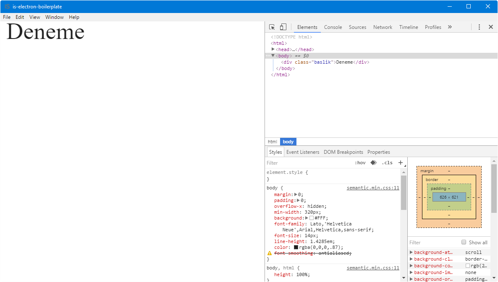

# is-electron-boilerplate

Masaüstü uygulama geliştirmek için kullandığım iskelet uygulama yapısı.

**Kullanılan Teknolojiler;**

- NodeJS
- Webpack
- Electron
- TypeScript
- jQuery
- jQuery UI
- Semantic UI

Gerekli paketleri kurmak için gerekli komut;
> npm install

Derleyip çalıştırmak için gerekli komut;
> npm run build && npm run start
